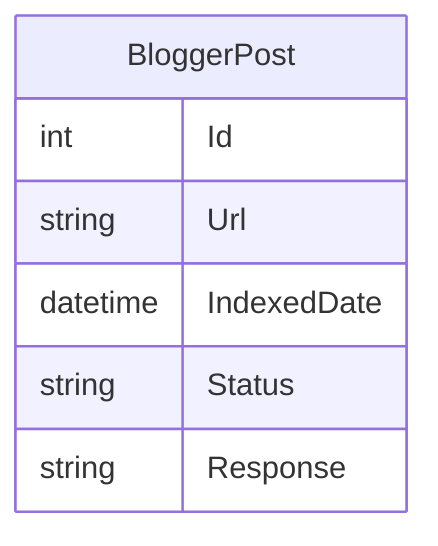

# BloggerIndexing_Net

**BloggerIndexing_Net** is an ASP.NET-based tool for automating the indexing of Blogger posts using Google's Indexing API. This project enables webmasters and SEO professionals to programmatically submit Blogger URLs for indexing, helping new content get discovered by Google faster.

---

## Features

- **Google Indexing API Integration:** Easily submit Blogger post URLs to Google for indexing.
- **Bulk Submission:** Index multiple URLs in one go.
- **Status Tracking:** Check indexing status for submitted URLs.
- **Secure API Calls:** Handles authentication and secure communication with Google.
- **Error Handling:** Displays status and errors for each submission.

---

## Technologies Used

- **ASP.NET Web Forms:** For UI and backend logic.
- **C#:** Handles API requests, authentication, and business logic.
- **Google APIs:** Integration with Google Indexing API.
- **JSON:** For data formatting and API communication.
- **.NET Libraries:** May include `HttpClient`, `Newtonsoft.Json`, etc.

---

## Typical Workflow

1. **Authenticate:** Configure Google service account credentials for API access.
2. **Input URLs:** Enter Blogger post URLs via the web interface or upload a file.
3. **Submit:** The application sends each URL to the Indexing API.
4. **Track Status:** View success/failure for each indexing request.

---

## Example Code Snippet

```csharp
using System.Net.Http;
using System.Net.Http.Headers;
using Newtonsoft.Json;

public async Task IndexUrlAsync(string url, string accessToken)
{
    var apiUrl = "https://indexing.googleapis.com/v3/urlNotifications:publish";
    var body = new { url = url, type = "URL_UPDATED" };
    using (var client = new HttpClient())
    {
        client.DefaultRequestHeaders.Authorization = new AuthenticationHeaderValue("Bearer", accessToken);
        var content = new StringContent(JsonConvert.SerializeObject(body), System.Text.Encoding.UTF8, "application/json");
        var response = await client.PostAsync(apiUrl, content);
        string result = await response.Content.ReadAsStringAsync();
        // Handle result (success or error)
    }
}
```

---

## Data Model (ER Diagram Example)



---

## Getting Started

1. Clone the repository.
2. Set up a Google Cloud project and enable the Indexing API.
3. Create a service account and configure credentials in your ASP.NET project.
4. Run the application, input Blogger URLs, and submit for indexing.

---

## License

This project uses open-source libraries (Newtonsoft.Json, etc.) and Google's Indexing API.
See individual libraries and Google's API documentation for licensing details.

---

## Author

Ashish Saurav

---

## Contributing

Pull requests, feature suggestions, and bug reports are welcome.
